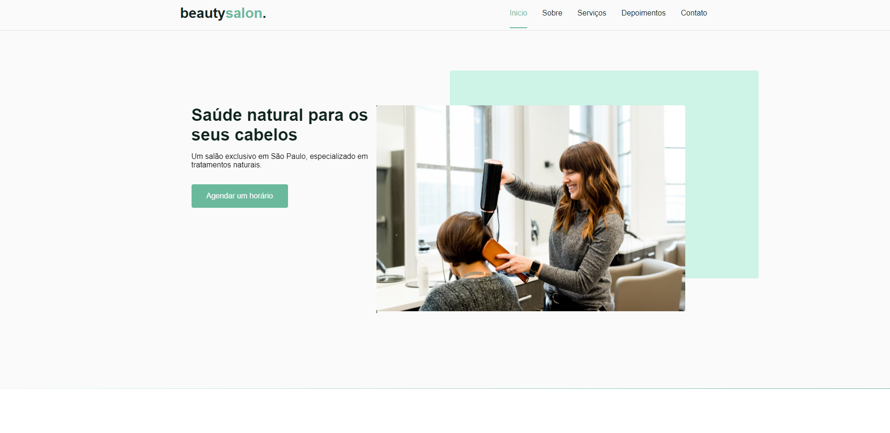

# Origin-six
 
 <table>
  <tr>
    <td align="center">
         
    </td>
</tr>
</table>
 
  <table>
  <tr>
    <td align="center">
        
    </td>
</tr>
</table>

##  🚀 Tecnologias

Esse projeto foi desenvolvido com as seguintes tecnologias:

- HTML
- CSS
- Javascript 

Bibliotecas

- [ Fontes do Google ](https://fonts.google.com/)
- [ SwipeJS ](https://github.com/nolimits4web/Swiper)
- [ ScrollRevel ](https://scrollrevealjs.org)

Utilitários

##  💻 Projeto

OriginSix é uma página institucional no formato One Page, responsiva, para uso em diversos tipos de micro, pequenas e médias empresas. Contém as seguintes seções: Header, Navigation, Home, Sobre, Serviços, Depoimentos, Contato e Footer

##  🔖 Disposição

Você pode visualizar o layout do projeto através de [ desse link ](https://www.figma.com/community/file/1009807319507822993/Origin-Six). É necessário ter conta no [ Figma ](https://figma.com) para acessá-lo.

##🤝 Colaboradores

<table>
  <tr>
    <td align="center">
      <a href="#">
         
        
          <b>Eudes Barbosa</b>
        
      </a>
    </td>
</tr>
</table>
 

[ ⬆ Voltar ao topo ](#Origin-six) 